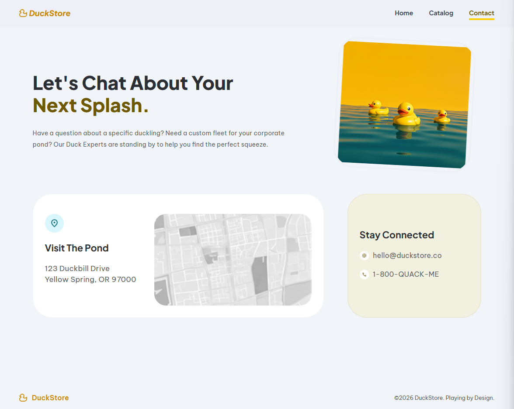
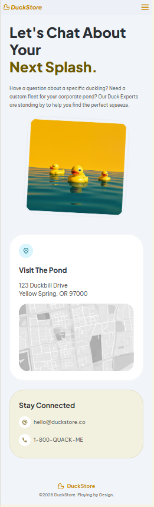
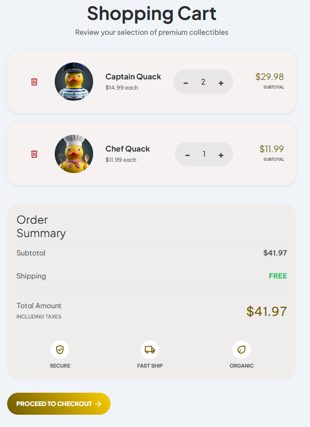
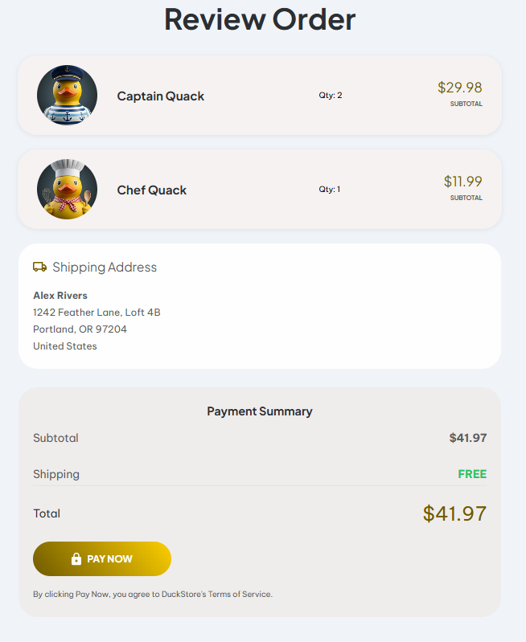
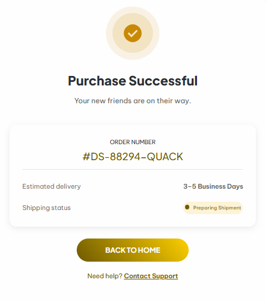

#  DuckStore

> Proyecto Frontend – Bootcamp Factoría F5 & FemCoders

DuckStore es una tienda online ficticia de patos de goma premium.
El proyecto evoluciona a lo largo de varios sprints, pasando de una web estática (Sprint 1) a una aplicación interactiva con carrito funcional y checkout completo (Sprint 2)


---

## 📑 Tabla de Contenidos

1. [Descripción General](#-descripción-general)
2. [Sprint 1 - Funcionalidades]()
3. [Sprint 2 - Funcionalidades]()
4. [Demostración Visual](#-demostración-visual)
5. [Instalación](#-instalación)
6. [Uso](#-uso)
7. [Tecnologías Utilizadas](#-tecnologías-utilizadas)
8. [Accesibilidad Implementada](#-accesibilidad-implementada)
9. [Mejoras Pendientes](#-mejoras-pendientes)
10. [Enlaces](#-enlaces)
11. [Autoras](#-autoras)

---

## 📝 Descripción General

DuckStore es un proyecto frontend desarrollado en el marco del Bootcamp de Factoría F5 & FemCoders.  
El objetivo es aplicar buenas prácticas de:

- HTML5 semántico
- CSS modular (BEM + mobile-first)
- Accesibilidad WCAG 2.1 AA
- JavaScript modular
- Arquitectura escalable
  -Trabajo colaborativo con metodología ágil (Scrum)

---

## 🟨 Sprint 1 - Funcionalidades

### 🎨 Diseño & Maquetación

- Landing page responsive
- Catálogo de productos
- Páginas de detalle individuales
- Navbar responsive
- Footer accesible
- Componentes reutilizables (cards, badges, botones)

### ♿ Accesibilidad

- Semántica HTML5 correcta
- Textos alternativos en imágenes
- Contraste revisado
- Foco visible
- Navegación por teclado
- aria-current="page" en navegación

### 📁 Estructura

- CSS modular
- Design System en Figma
- Organización clara de assets

---

## 🟦 Sprint 2 — Funcionalidades

### 🛒 Carrito funcional

- Añadir productos desde las páginas de detalle de cada producto
- Actualizar cantidades
- Eliminar productos
- Persistencia con localStorage
- Estado sincronizado entre páginas

### 📦 Checkout completo

#### Review Order

- Render dinámico de productos
- Subtotal por producto
- Cantidad
- Imagen
- Diseño responsive y accesible

#### Payment Summary

- Subtotal general
- Envío (FREE)
- Total final
- Botón Pay Now
- Navegación a Success Page

#### Success Page

- Mensaje de confirmación
- Carrito vaciado automáticamente
- CTA para volver a la tienda

### 🧩 Arquitectura JavaScript modular

- `features/cart/cartState.js` → estado global
- `features/cart/cartLogic.js` → cálculos
- `features /cart/cartUI.js` → render dinámico
- `features/products/createProductDetail.js`→ render del detalle del producto
- `features/products/productCart.js`→ render de la tarjeta del producto general en el catálogo
- `features/products/products.js`→ array de productos disponibles
- `/pages/*.js` → lógica por página
- Código limpio, reutilizable y escalable

### ♿ Accesibilidad dinámica

- Focus visible en elementos generados por JS
- Lectura correcta de totales
- Botones con aria-label
- Estructura semántica en componentes dinámicos

---

## 🚀 Demostración Visual

### Sprint 1






# Sprint 2







---

## ⚙️ Instalación

1. Clona el repositorio:

   ```bash
   git clone https://github.com/SiuzannaVach/DuckStoreF5.git
   ```

2. Accede al directorio del proyecto:

   ```bash
   cd DuckStoreF5
   ```

3. Abre Visual Studio Code

   ```bash
   code .
   ```

## 🧩 Uso

- Explora el catálogo
- Añade productos al carrito
- Revisa tu pedido en *Review Order*
- Finaliza la compra en *Payment Summary*
- Llega a la *Success Page*

---

## 📁 Arquitectura

```
DuckStoreF5/
│
├── index.html
│
├── src/
│   ├── assets/
│   │   ├── icons/
│   │   │   └── (iconos del proyecto)
│   │   ├── images/
│   │   │   └── (imágenes del catálogo y páginas de detalle)
│   │   └── screenshots/
│   │       └── (capturas usadas en el README)
│   │
│   ├── css/
│   │   ├── catalog.css
│   │   ├── contact.css
│   │   ├── detail-product.css
│   │   ├── footer.css
│   │   ├── landingpage.css
│   │   ├── navbar.css
│   │   ├── reset.css
│   │   └── style.css   ← archivo principal que importa todos los módulos
│   │
│   ├── js/
│   │   ├── cart/
│   │   │   ├── cart.js
│   │   │   ├── cartLogic.js
│   │   │   └── cartState.js
│   │   ├── components/
│   │   │   ├── createProductDetail.js
│   │   │   ├── productCard.js
│   │   │   └── products.js
│   │   ├── pages/
│   │   │   ├── catalog.js
│   │   │   ├── contact.js
│   │   │   ├── productDetail.js
│   │   │   └── reviewOrder.js
│   │   └── main.css
│   │
│   └── pages/
│       ├── cart.html
│       ├── catalog.html
│       ├── contact.html
│       ├── product-detail.html
│       ├── review-order.html
│       └── success.html
│
└── README.md

```

## 🛠 Tecnologías Utilizadas

### 🎨 Diseño & Gestión

- **Figma** — Diseño UI/UX y Design System
- **Stitch** — Sistema de componentes
- **Jira** — Gestión ágil del proyecto
- **VS Code** — Entorno de desarrollo
- **Git & GitHub** — Versión de controles

### 💻 Desarrollo

- HTML5
- CSS3 modular
- JavaScript ES Modules
- localStorage

---


## 🟦 Accesibilidad Implementada

- Semántica HTML5
- Navegación por teclado
- Focus visible
- aria-live para totales
- Contraste WCAG 2.1 AA
- Imágenes con alt
- Botones accesibles
---

## 🟧 Mejoras Pendientes

### 🔸 Accesibilidad y UX dinámica
- Implementar un *feedback visual al añadir un producto al carrito*:
   - Animación suave del icono del carrito
   - Cambio temporal de color o badge de cantidad
   - Microinteracción accesible (aria-live) para usuarios con lector de pantalla
   - Indicador visual claro de que el carrito contiene productos

### 🔸 Navegación
- Mejorar la *navegación entre páginas de detalle y el catálogo general*, asegurando:
   - Un botón “Volver al catálogo” visible y accesible
   - Mantenimiento del scroll original del catálogo
   - Flujo más natural entre exploración y detalle

### 🔸 Accesibilidad
- Añadir `prefers-reduced-motion` para usuarios con sensibilidad al movimiento
- Revisar contraste en estados interactivos tras añadir JavaScript
- Mejorar la gestión del foco en elementos dinámicos (checkout, overlays, botones generados por JS)

### 🔸 JavaScript
- Añadir tests unitarios para la lógica del carrito
- Optimizar la arquitectura modular para futuras funcionalidades

---

## 🔗 Enlaces

- [**GitHub Pages**](https://siuzannavach.github.io/DuckStoreF5/)
- [**Jira del proyecto**](https://aidagarciaf5.atlassian.net/jira/software/projects/DST/boards/1?selectedIssue=DST-79&atlOrigin=eyJpIjoiYjU2ZjM1NWZlOGNlNDkxOWExM2RhOTBkOWJlMmM3ZjYiLCJwIjoiaiJ9)
- [**Figma (Design System + prototipo)**](https://www.figma.com/design/qfpxntI80xDhP2UWs282hR/Sketch--Mockup---Prototype?node-id=0-1&t=ZkgZfaiigTb6EZrP-1)

---

## 👩‍💻 Autoras

- [**Aïda García**](https://github.com/aidag91) — Equipo de desarrollo y Scrum Master
- [**Rukayatu Seidu**](https://github.com/rseidu941-commits) — Equipo de desarrollo
- [**Siuzanna Vachaganian**](https://github.com/SiuzannaVach/) — Equipo de desarrollo y Product Owner
